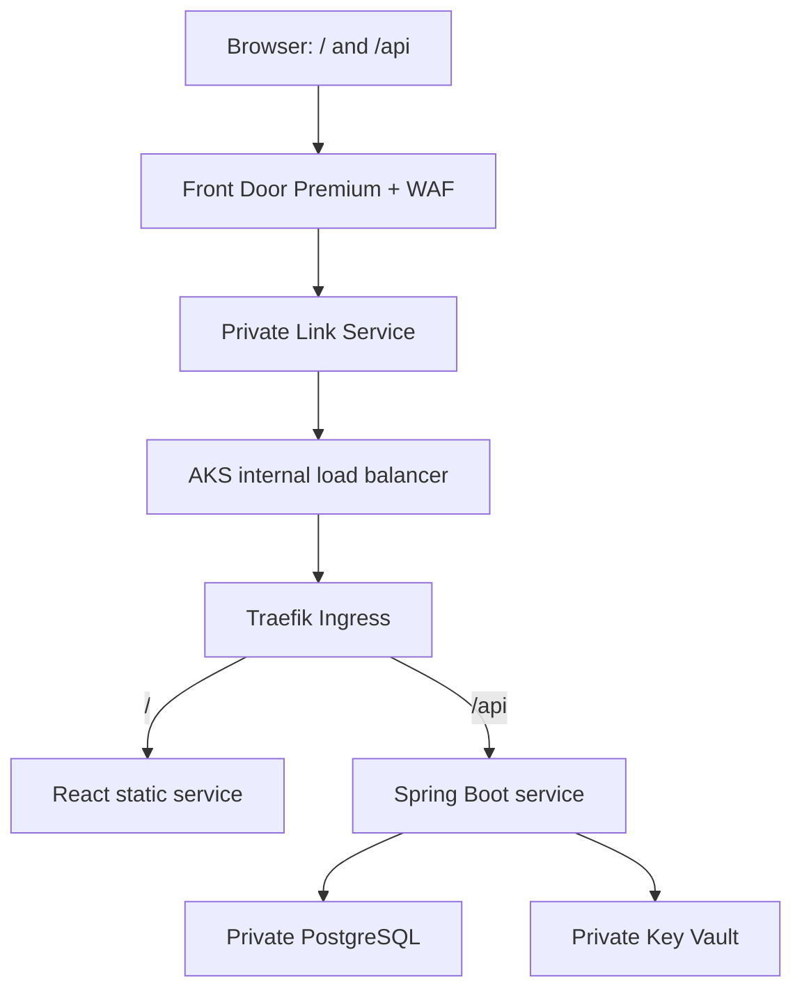

# End-to-end lab plan and acceptance criteria

This is the implementation contract. Phase 1 code is present; subsequent phases will add runnable Terraform, Helm, CD and drill code to this same repository. A design entry below is not evidence that a resource has been created.

## Environment layout

| Environment | URL | AKS | Namespace | PostgreSQL |
|---|---|---|---|---|
| dev | `dev.azuredevops.site` | `aks-notekeeper-nonprod` | `notekeeper-dev` | Nonprod server, `notekeeper_dev` database |
| staging | `staging.azuredevops.site` | Same nonprod cluster | `notekeeper-staging` | Nonprod server, separate `notekeeper_staging` database |
| prod | `azuredevops.site` | `aks-notekeeper-prod` | `notekeeper-prod` | Separate prod server/database |

Use the standard spelling `staging`, rather than `stagging`. Each environment gets a distinct ServiceAccount and federated managed identity. Dev cannot access staging/prod databases or secrets. Separate databases on a shared nonprod server reduce cost but do not provide server-level isolation.

## Traffic and private connectivity

DNS resolves a hostname before the HTTP request; DNS is not an HTTP proxy hop. Azure DNS records resolve the custom domains to Front Door.



One Premium Front Door profile can host all three custom domains with distinct routes/origins and domain-scoped WAF controls. Each AKS cluster gets its own internal ingress endpoint and Private Link Service. The nonprod ingress routes dev/staging by Host header; Front Door must preserve the intended custom Host when reaching it. Prod uses only its own origin. `/api/*` has caching disabled; static asset caching is limited to hashed assets. Do not cache index.html or runtime-config.js across environments. Test that nonprod hosts cannot reach prod origins.

Use Traefik's supported Kubernetes Ingress provider, with a pinned tested chart version. It satisfies the explicit Ingress requirement without deploying the retired community ingress-nginx controller. Nginx inside the React image is only a static HTTP server.

TLS is configured and validated on both browser→Front Door and Front Door→origin. Origin certificate hostname, origin Host header and health-probe host/path must be aligned, not bypassed by disabling certificate validation. Use an appropriate DNS-validated origin certificate and store it in Key Vault; provision its lifecycle before connecting HTTPS origins. Plan a dedicated origin hostname/Ingress rule if Front Door health probes cannot send the same application host. Prove healthy probes and `/api` routing before enabling custom domains.

AKS control planes and DB/Key Vault are private. GitHub OIDC supplies identity, **not network reachability**. CD and private Terraform/state operations need an ephemeral runner on approved private networking. Runner bootstrap/registration credentials, lifecycle and trust boundaries must be documented; untrusted fork PR code never executes on privileged private runners. Avoid a permanent shared privileged runner.

Terraform owns Azure VNets/subnets, private DNS, identities, RBAC, AKS, DB servers, Front Door/WAF/DNS and monitoring resources. Helm owns Kubernetes workloads and routing. An internal LoadBalancer Service inevitably asks the AKS Azure cloud controller to create Azure load-balancer components; it is an explicit platform exception, not an application Helm chart provisioning arbitrary Azure infrastructure. To keep Private Link Service ownership in Terraform, first establish ingress/ILB, resolve its frontend IP configuration, then apply the origin/PLS layer. Do not have both Service annotations and Terraform own the same PLS.

## Lab sizing and cost controls

Central India is the target. Before apply, check the current AKS versions, VM family quota, PostgreSQL SKUs, Managed Grafana availability, and Front Door Private Link supported region mapping. Region availability is not established by selecting a Terraform location.

| Resource | Initial lab setting | Why |
|---|---|---|
| AKS | Two clusters, one system pool each | Required prod/nonprod boundary |
| Nodes | Candidate `Standard_D2s_v5`, autoscaler 1–2 per cluster | Two vCPU/eight GiB candidate; validate current AKS support/quota |
| AKS tier | Free where available for the lab | No paid control-plane SLA needed for an exercise |
| API | One replica/environment; request 250m/512Mi, limit 1 CPU/1Gi | JVM plus agent need memory headroom |
| Frontend | One replica/environment; request 50m/64Mi, limit 250m/128Mi | Static serving is small |
| HPA | Start 1–2; configure only after metrics/resources work | Practice scaling within bounded spend |
| PostgreSQL | Two small Burstable Flexible Servers, HA off | One shared nonprod server, one isolated prod server |
| DB candidate | `B_Standard_B1ms`, minimum supported storage | Validate capacity/region; small Hikari pools reduce connections |
| ACR | Basic with identity-authenticated public endpoint initially | Avoid Premium solely for a private registry endpoint in the lab |
| Front Door | One **Premium** profile | Required Private Link support; tier is not downgraded |
| Grafana | One Managed Grafana instance, smallest supported tier for required integration | Share dashboards/data sources, retain separate workspace access |
| Workspaces | One AMW and one LAW per isolation boundary | Nonprod/prod separation without three full stacks |
| Key Vault | Separate vault per environment | Simple least-privilege and secret lifecycle isolation |
| Archive | Off normally; selected export only for the archive exercise | Avoid continuously duplicating operational logs |

One-node clusters and single replicas are a deliberate lab setting: they do not provide production availability. A prod-named environment still teaches isolation, approvals and promotion. PDBs must match replicas; a one-replica PDB requiring one available pod will block drains. We will use a lab-compatible disruption policy and explain the HA alternative.

The ACR endpoint is reachable over the Internet but its private repositories require Entra authorization. Upgrade to Premium plus private endpoints only for the private-registry exercise. Front Door Premium, Grafana, VM nodes, DB storage, private endpoints and egress have costs even with little traffic. We will calculate a current estimate using your subscription/currency before applying, add budget alerts, tag all resources, and provide ordered cleanup. A budget alert does not stop spending. Stopping AKS/DB does not stop every related resource charge.

## Identity and scoped authorization

Interpret the requirement as **only the access each workload needs**. Broad access would contradict the least-privilege principles in the theory.

| Actor | Authentication | Scope/permissions |
|---|---|---|
| Human bootstrap operator | `az login`/Entra MFA | Enough to create scoped deployment identities and initial state resources; not an app credential |
| Infrastructure plan/apply | GitHub OIDC, distinct trust from app deploy | Target resource groups plus separate reviewed role-assignment permissions; state container Blob Data access |
| Dev/staging/prod deployer | Environment-specific GitHub OIDC subjects | Get cluster user credentials on target cluster and Kubernetes RoleBindings in only its namespace |
| Platform/bootstrap deployer | Separate controlled identity | Install ingress, collectors/CRDs and namespace RBAC; not granted to ordinary app deployment jobs |
| Registry publisher | GitHub OIDC to Azure | Repository Writer conditioned to the two application repositories; no state or infrastructure administration |
| AKS kubelet | AKS managed identity | Repository Reader conditioned to the application repositories; it pulls images, not the application's ServiceAccount |
| API runtime | Per-environment AKS Workload Identity | PostgreSQL DML in its database; read only required Key Vault secrets; telemetry publishing if supported/configured |
| Migration job | Separate federated identity | Schema creation/migration rights in just its environment DB |
| Grafana | Managed identity | Read metrics from exactly the relevant Azure Monitor Workspaces |

ACR uses RBAC + ABAC repository permissions. Use Repository Reader/Writer roles with Request repository-name conditions; legacy AcrPull/AcrPush are not honored in this mode. The bootstrap separates ordinary registry management from privileged role assignment.

OIDC subjects must include your exact owner/repository and GitHub environment, such as `repo:anuragdchowdhury/ci-cd-project:environment:prod`. Audience is `api://AzureADTokenExchange`; use job-local `id-token: write` only in jobs that log in to Azure. Environment protection and workflow branch restrictions are part of the trust boundary. A reviewed bootstrap must also provision role-assignment permissions; ordinary Contributor cannot grant RBAC to itself.

Azure RBAC does not grant PostgreSQL SQL privileges. Connect as the configured Entra DB administrator from a private runner; register each identity's object ID in PostgreSQL, create roles, and grant database/schema/table/default privileges. Runtime gets SELECT/INSERT/UPDATE/DELETE, with no server-admin or schema-owner rights. Migrations use their own identity, complete before rollout, and remain compatible with the previous release for rollback.

Terraform creates Key Vault and identity/RBAC resources, not real secret values. Actual unavoidable secrets enter Key Vault through an approved private operator/rotation process, avoiding Terraform state. Exercise CSI Workload Identity with a dummy external credential, without syncing it into a Kubernetes Secret. Applications must re-read rotated mounted values; environment variables do not refresh automatically. Entra PostgreSQL has no DB password to rotate. Key, certificate and external-secret rotation get distinct drills.

## Telemetry ownership and retention

| Signal | Collector/store | Lab retention/controls |
|---|---|---|
| Kubernetes/node/JVM/HTTP/business metrics | Managed Prometheus → AMW → Managed Grafana | Managed service retention, currently 18 months; not a custom Blob archive |
| API requests/dependencies/spans/sanitized exceptions | Java agent → backend Application Insights → LAW | 30 days initially, routine requests sampled |
| Browser page views/failures/dependencies | Browser AI SDK → separate browser Application Insights → LAW | 30 days, no cookies or note contents; privacy/volume filters |
| Container application logs | AMA/Container Insights → DCR → ContainerLogV2 in LAW | 30 days, ERROR/CRITICAL normally; stream-specific transformations |
| Kubernetes inventory/events | Selected Container Insights streams | Needed inventory and useful warning events; omit overlapping Perf/InsightsMetrics streams |
| Control plane/resource/security diagnostics | Explicit diagnostic settings → selected LAW tables | One setting per intended destination/category; do not enable everything blindly |
| Compliance/archive exercise | Selected supported LAW tables → Blob | Opt-in only, lifecycle policy; do not create three telemetry storage accounts |

Use backend and browser AI resources per environment, so backend ingestion can have stronger identity requirements without blocking the browser SDK, which does not support Entra-authenticated ingestion. Validate the exact Java-agent authentication route with AKS federation in the telemetry phase; a UAMI setting must not be assumed to consume projected Workload Identity tokens. If the selected agent cannot do so directly, implement a supported authenticated export path before disabling local ingestion. Do not silently give pods the node identity or put a client secret in them.

Java agent logging export is OFF, including logger-based exception export. Sanitized exception events are recorded on the active span; container severity logs have one ingestion owner. Agent Micrometer export is disabled and a documented metric filter excludes its other metrics. Backend OTel API is used for correlation/events, not a second SDK/exporter. Instrumentation is installed once; never also enable another automatic Java injection path for the same pod. Platform-derived APM metrics are distinct from raw JVM/Prometheus copies.

Configure a DCR data flow for the individual ContainerLogV2 stream, not the grouped default stream when it prevents the desired transformation. Illustrative severity filter, to be tested against the actual records:

```kusto
source
| where toupper(LogLevel) in ("ERROR", "CRITICAL")
```

Verify that Spring's JSON severity is recognized. If records arrive as UNKNOWN, fix parsing/collection before relying on the filter; otherwise real errors can be dropped. Apply namespace/annotation exclusions as well. Temporarily enable targeted INFO/DEBUG with an expiry and restoration procedure. Kubernetes Warning events are a separate stream and must not be removed by applying the log filter to every table.

One event can yield a log, a failed request span and a counter: those are different signals. An intentional Blob export is a second stored copy. The requirement is **no accidental duplicate ingestion**, not an impossible guarantee that distributed collectors deliver every record exactly once. Audit DCR associations, diagnostic settings, scrape targets, collector configuration and SDKs; inspect counts/billed size and confirm one owner per stream. Do not export AppTraces/ContainerLogV2 indiscriminately just because export exists.

Sampling is normally 10% for routine backend requests. Head sampling cannot guarantee retention of every unexpected error or slow request discovered after span start. For drills temporarily use 100% on the affected service or a known test route; validate and restore it. A requirement to retain all error traces needs an explicitly supported tail-sampling design, not a claim that normal head sampling does it.

## Build once, promote by digest

Main CI builds/tests two immutable images. After the Azure/security checkpoints, publish directly to one ACR using a scoped GitHub OIDC identity and the full Git SHA. The prior GHCR milestone is complete and publication is now paused; there is no ongoing GHCR mirror. A release manifest records both ACR registry digests as one release pair. Never rebuild per environment and never deploy `latest`.

CD: deploy dev → verify readiness, API CRUD and telemetry → deploy staging → repeat validation → protected prod environment approval → deploy prod → validate and watch errors. Approval protection is configured in GitHub settings; `environment: prod` alone does not establish reviewers. Use a protected workflow with fixed artifact-origin checks, namespace scope, per-environment concurrency, immutable release selection, and previous-digest rollback. Helm uses atomic/waited rollouts; database compatibility is checked separately. Do not use an untrusted workflow_run artifact blindly.

Terraform pipeline is separate: format/validate/security-policy checks → plan → reviewed saved plan → protected apply of that same plan. Plans/state are confidential; exclude them from Git and restrict artifact access. Backend uses Entra/OIDC, Blob versioning, soft delete and no account keys. A private backend needs the private runner path even for a plan that refreshes state.

## Ordered milestones and acceptance gates

| Phase | Deliverables | Observable completion |
|---|---|---|
| 1 | Application, local PostgreSQL, Dockerfiles, first CI | CRUD persists; tests pass; SHA tags and release manifest exist |
| 2 | Base-image/agent checksum pinning, dependency/image/SAST gates, release immutability | Deliberate vulnerable change fails; clean tested release passes; no CI metrics collection |
| 3 | Azure CLI/subscription selection, providers, quotas, state bootstrap, OIDC, budgets and Basic ACR | GitHub gets short-lived Azure tokens; state accessible via Entra; scoped registry IAM; no static cloud secret |
| 4 | Terraform foundation/nonprod/prod stacks; private runners; DB and kubelet registry access | Two clusters, private DB/Key Vault, working private DNS; identities denied outside their scope |
| 5 | Helm ingress/workloads, DB principal/migration job, PLS/Front Door wiring, DNS/TLS, CD | Three hostnames, `/api` routing, same digest pair, prod approval, safe rollback |
| 6 | Terraform AMW/LAW/AI/Grafana/DCR/alerts; collector and agent configuration | Metrics, logs and traces arrive, correlate, obey retention/filtering, and pass duplication audit |
| 7 | Dashboards and repeatable nonprod-only incident drills | Each rule shows before/trigger/fired/recovery evidence and logs/trace IDs where meaningful |
| 8 | Cleanup, backup/restore exercise, final runbook | Resource inventory reconciles; selected data recoverable; remaining costs known |

## Planned alert and simulation matrix

Every implemented alert must have a rule ID, signal/query, threshold/window, affected environment, an actual trigger script, expected evidence, notification route, recovery script and cleanup. Simulations run in dev using isolated test workloads or controlled temporary configuration. Never add unauthenticated public `/crash` or `/oom` endpoints. Expected examples are labeled illustrative until actual runs produce evidence.

| Case | Safe trigger | Expected evidence |
|---|---|---|
| HTTP 5xx / exception surge | Bounded private fault workload or temporary dev DB grant denial | Prometheus error ratio, failed AppRequests, dependency/exception span and error log with shared trace ID |
| Slow request / DB dependency | Bounded test DB query/sleep in a private drill job | HTTP histogram p95 and slow AppDependencies; trace identifies the bottleneck |
| Connection pool exhaustion | Bounded concurrent slow DB requests | Hikari pending/timeout metrics; correlated failures |
| Pod restart / CrashLoopBackOff | Separate labeled Deployment with failing startup | Pod state/restarts in Grafana; Kubernetes events; no application trace expected before process startup |
| OOMKilled | Disposable memory-limited test Deployment | Container termination reason and restart metric; process may emit no final log/trace |
| Deployment/readiness unavailable | Temporary dev rollout with bad readiness configuration, then restore | Unavailable replicas, Kubernetes warning events and rollout failure |
| CPU throttling / HPA maximum | Bounded load against disposable workload | CPU/throttle/replica metrics; HPA saturation alert |
| Heap / GC pressure | Bounded private Java drill job | JVM heap/GC metrics; stop before exhausting shared node memory |
| Node NotReady / pressure / Pending / autoscaler limit / PV issue | Dedicated disposable capacity test; lower-disruption scheduling faults first | Node/scheduler/storage events and corresponding metric alert; no fabricated trace |
| Front Door origin unhealthy / 5xx / latency | Temporarily break only the dev origin probe/routing or backend | Front Door metric alert, probe diagnostic evidence, recovery after restore |
| WAF abnormal block/rate-limit spike | Bounded benign requests matching a temporary dev-only test rule | WAF diagnostics/block counts and alert; do not attack unrelated services |
| Key Vault denial | Dev identity reads a different environment's dummy secret | Denied request, Key Vault audit logs, scoped-access validation |
| Secret/key/certificate nearing expiry / rotation failure | Short-lived dummy objects and controlled failed rotation | Event Grid/automation/expiry alert and new version; no real credential invalidation |
| Image vulnerability / unexpected registry action | Known test fixture rejected before deployment; separate controlled push identity | Scanner/policy evidence and registry audit alert |
| Log filtering / trace correlation | Emit severity ladder through an authenticated private drill | Only allowed severity ingested; AppRequests.OperationId matches ContainerLogV2 JSON traceId |
| Export failure / storage authorization or growth | Optional archive exercise with bounded data and controlled permission fault | Export health evidence/alert; archive bytes and lifecycle behavior |

Dashboard panels cover service RED, Kubernetes capacity/availability, JVM/DB pool, and Front Door/WAF. Prometheus exemplars linking to sampled traces require collector/store/UI support; don't promise an automatic link unless tested. Otherwise use time/service labels and captured trace IDs. Node crashes, browser failures before reaching the backend, and WAF blocks can legitimately have no backend trace.

Illustrative correlation queries (replace the placeholder after a real drill):

```kusto
let trace = "<actual-32-hex-trace-id>";
ContainerLogV2
| extend payload = parse_json(tostring(LogMessage))
| where tostring(payload.traceId) == trace
| project TimeGenerated, PodNamespace, PodName, LogLevel, LogMessage
```

```kusto
let trace = "<actual-32-hex-trace-id>";
union AppRequests, AppDependencies, AppExceptions
| where OperationId == trace
| order by TimeGenerated asc
```

## External/bootstrap operations Terraform cannot fully do for us

1. Select/activate the Azure subscription, billing and human bootstrap authority; verify current quotas and required provider registrations.
2. Create/configure GitHub environments/reviewers and branch rules through the account's settings or an explicitly authorized provider. Never assume YAML alone protects prod. Delete the two historical GHCR packages once their checkpoint is complete; future releases go only to ACR.
3. Bootstrap the state backend with initial authenticated access, then migrate local bootstrap state to the protected remote backend; never commit it.
4. Register ephemeral private runners using a narrowly scoped, approved GitHub credential/registration process. Runner identity and deployment identity are separate.
5. Initialize PostgreSQL Entra principals/SQL grants and apply migrations from private connectivity. Cloud resource RBAC alone is insufficient.
6. Populate unavoidable Key Vault secrets and obtain/renew the origin certificate through a controlled process without embedding values in Terraform.
7. Approve Front Door's managed Private Link connection to each PLS if the chosen provider/API cannot safely automate that approval. Terraform origin creation alone does not prove approval/connectivity.
8. At **Namecheap**, change the domain's nameservers to all four exact nameservers output by the Azure DNS zone. Copy existing needed email/TXT/MX records into Azure DNS before delegation. Terraform in Azure cannot change Namecheap's registrar delegation without a separate authorized integration.
9. Terraform creates Front Door custom-domain validation TXT records, subdomain CNAMEs and the supported Azure DNS apex alias. Wait for DNS propagation, domain validation and certificate issuance; do not invent Front Door public IP A records. Azure private DNS is a separate namespace/connectivity concern.
10. Configure/verify alert notification recipients and action-group delivery; collect actual alert evidence and verify recovery.

## References used for design

- AKS ingress retirement: https://learn.microsoft.com/azure/aks/app-routing-nginx-to-gateway-api-migration
- Traefik Ingress: https://doc.traefik.io/traefik/providers/kubernetes-ingress/
- Front Door ILB Private Link: https://learn.microsoft.com/azure/frontdoor/standard-premium/how-to-enable-private-link-internal-load-balancer
- Container log transforms: https://learn.microsoft.com/azure/azure-monitor/containers/container-insights-transformations
- Managed Prometheus: https://learn.microsoft.com/azure/azure-monitor/metrics/prometheus-metrics-overview
- DNS delegation: https://learn.microsoft.com/azure/dns/dns-delegate-domain-azure-dns
- Application Insights Java configuration/authentication: https://learn.microsoft.com/azure/azure-monitor/app/java-standalone-config and https://learn.microsoft.com/azure/azure-monitor/app/azure-ad-authentication
