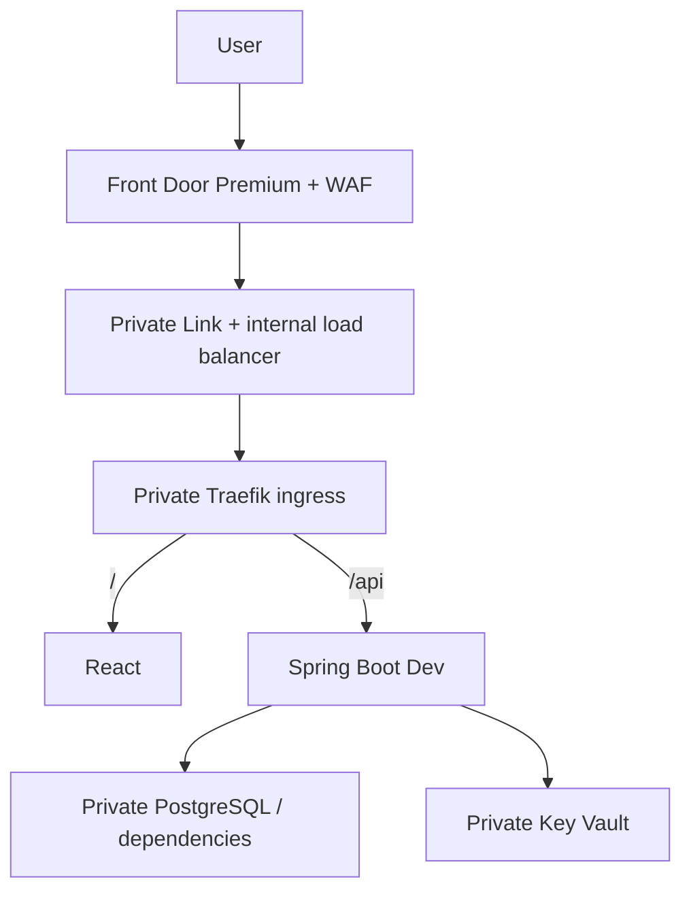

# Dev-only end-to-end Azure lab plan

This revision supersedes the initial three-environment deployment for the current quota-constrained hands-on. Only Dev is active. Staging/prod are deferred; bootstrap, ACR, state storage and all existing state containers remain intact. Terraform code is not evidence of a successful Azure apply.

## Current deployment and quota

| Setting | Active choice |
|---|---|
| Host | `dev.azuredevops.site` (DNS/TLS phase) |
| Terraform root/state | `infra/nonprod`, existing `tfstate-nonprod` container/key |
| AKS / namespace | `aks-notekeeper-nonprod` / `notekeeper-dev` |
| Nodes | Two fixed D4s_v4 nodes, four vCPUs each; autoscaling off; zones unset |
| Recorded Central India Compute quota | Ten regional vCPUs; ten DSv4 vCPUs; zero DSv5 vCPUs |
| Database | One private B1ms PostgreSQL server, `notekeeper_dev` only |
| Vault and identities | Dev vault, runtime/migration/deploy identities only |

Eight vCPUs are used by AKS; at most two regional vCPUs remain for a runner/other Compute usage. Current usage and provisioning capacity must be checked. Front Door Premium, managed PostgreSQL, Managed Prometheus and Managed Grafana do not consume this Compute vCPU quota. Their Kubernetes agents/collectors consume the AKS nodes' CPU/memory; bound requests and tune retention/collection rather than adding nodes implicitly.

**Upgrade exception:** AzureRM 5.8.0's default system-pool schema has no max_unavailable field, and AKS does not support maxUnavailable on system pools. A zero-surge draining upgrade cannot be promised here. Keep supported max_surge=1, disable automatic Kubernetes/node OS upgrades for the temporary lab, and defer managed upgrades until regional/family quota can cover twelve AKS vCPUs plus other Compute usage or a different supported maintenance design is reviewed. See Step 4. Manual draining is an availability exercise, not proof of a no-surge managed upgrade.

## Required traffic architecture



Terraform owns Azure resources; Helm owns workloads/ingress. The AKS cloud controller creates its load balancer as an explicit platform exception. Terraform owns the subsequent PLS/origin wiring; do not also enable automatic PLS ownership through Service annotations. Front Door must preserve the correct origin Host header, use validated TLS on both hops, and have healthy probes. Cache hashed static assets only; never cache API responses or environment runtime-config/index.html indiscriminately. Front Door/WAF restricts the no-login demo to operator traffic.

DNS records resolve to Front Door; DNS is not an HTTP proxy hop. Azure DNS Terraform cannot delegate the registrar's nameservers: copy needed existing MX/TXT records before updating Namecheap delegation. Complete custom-domain validation/certificate issuance and any required private-link approval, then test `/` and `/api` end to end.

## Security essentials retained

Private AKS API, private PostgreSQL and vault endpoints, Entra-only database authentication, passwordless ACR image pulls, workload identity and scoped RBAC remain. OIDC authenticates a workflow but does not supply private network reachability: install the deployment runner on approved private networking before CD. Untrusted PR code never executes on that privileged runner.

The kubelet identity pulls only the two application image repositories. Dev runtime federation trusts exactly `system:serviceaccount:notekeeper-dev:notekeeper-api`; migration uses its distinct account/identity. SQL administrator initialization grants runtime DML only and migration schema privileges; Azure RBAC does not grant SQL access. Populate unavoidable vault values through private operator access, not Terraform state, and use CSI workload identity without unnecessary Kubernetes Secret copies.

The Dev GitHub deploy identity uses the already-established immutable owner/repository ID subject plus environment `dev`. It can get cluster user credentials and write only the Dev namespace; platform namespace/ingress/collector setup uses separate operator/platform authority. No cloud passwords, broad workload Contributor grants or registry admin credentials are introduced.

## CI/CD and infrastructure workflow

Main builds, tests, scans and publishes one SHA-tagged backend/frontend pair to one ACR; release.json records both digests. Deploy those exact digests. Environment/runtime configuration stays outside image builds. Retain previous digests for Helm rollback and backwards-compatible migrations. Do not recreate GHCR mirrors or use latest. No GitHub build metrics are collected.

Terraform uses the existing Azure remote state, Entra authentication and confidential saved plans. Review a freshly generated plan before applying that exact plan. Never discard state after a failed apply. Bootstrap/ACR are independent roots and are not destroyed to revise the Dev platform. Capture No changes after apply and later use a controlled manual change for the drift exercise.

## Required observability (subsequent implementation)

| Signal | Owner / store | Controls |
|---|---|---|
| Kubernetes, JVM, HTTP and business metrics | Managed Prometheus / Azure Monitor Workspace / Managed Grafana | Service RED, JVM/pool and infrastructure dashboards; managed retention |
| Backend spans, requests, dependencies, sanitized exception events | One Java agent / backend Application Insights / Log Analytics | Start with 30-day table retention and 10% routine sampling; temporarily 100% for drills |
| Browser telemetry | Browser SDK / separate browser Application Insights | Public browser ingestion, privacy/volume controls; no note contents or credentials |
| Container logs | AMA / explicit DCR / ContainerLogV2 in Log Analytics | 30 days; verified JSON severity parsing and ERROR/CRITICAL filter normally |
| Inventory and Kubernetes Warning events | Selected Container Insights streams | Keep useful availability evidence; omit overlapping Perf/InsightsMetrics |
| Resource diagnostics | Explicit single diagnostic setting per intended stream/destination | Selected Front Door/WAF, vault, DB and platform categories |
| Optional archive exercise | Selected supported LAW export / Blob lifecycle | Off normally; explicit intentional copy, not broad duplicate exports |

Configure and prove the trace backend, not just the agent. Validate the supported Java-agent authenticated ingestion path with projected workload tokens before disabling local backend ingestion authentication; do not substitute the node identity or a static client secret. The browser SDK cannot use Entra ingestion authentication. Java-agent log/Micrometer export stays off to avoid a second owner for those signals; no additional Java SDK/auto-injection exporter. Container severity transforms apply to the individual log stream, not Kubernetes events. Verify parsing before filtering UNKNOWN logs away.

Audit DCR associations, diagnostic settings, scrape targets and SDKs. The goal is no accidental duplicate ingestion; distributed delivery does not guarantee exactly-once events. Different signals from one request are legitimate. Head sampling cannot guarantee every error/slow trace: use controlled 100% drill sampling and restore it; tail sampling needs a separately supported design. Do not promise Prometheus exemplar links before collector/store/UI support is tested; trace IDs plus time/service labels provide an explicit correlation path.

## Milestones and cost controls

1. Completed: local CRUD, containers, CI security gates, Azure bootstrap/remote state, OIDC and ACR main publication.
2. Current: review/apply the Dev-only foundation with quota checks and a saved plan, then verify private resource configuration and No changes.
3. Private runner/network validation, SQL principals/migration, namespace/bootstrap and Helm Dev deployment with readiness, CRUD and digest verification.
4. Front Door Premium, private ingress/PLS, DNS/TLS and restricted website/API access.
5. Terraform telemetry resources, collectors/DCR/retention, trace backend, Grafana dashboards and explicit alert/action groups.
6. Bounded Dev-only drift, overload, latency, failure, correlation and recovery exercises; retain actual output, not invented screenshots.
7. Backup/restore and ordered cleanup, including remaining costs.

Estimate two D4s_v4 nodes, B1ms DB/storage, endpoints/disks/networking now, then Premium Front Door, Grafana, ingestion and any runner separately. Budgets notify rather than stop spend; the node resource group needs its own budget. Stop/deallocate for pauses with storage/network charges continuing. Remove workloads/origins/runners before destroying the Dev platform. Never remove remote-state storage as part of ordinary lab cleanup.

## Planned alert and simulation matrix

Every implemented alert must have a rule ID, signal/query, threshold/window, affected environment, an actual trigger script, expected evidence, notification route, recovery script and cleanup. Simulations run in dev using isolated test workloads or controlled temporary configuration. Never add unauthenticated public `/crash` or `/oom` endpoints. Expected examples are labeled illustrative until actual runs produce evidence.

| Case | Safe trigger | Expected evidence |
|---|---|---|
| HTTP 5xx / exception surge | Bounded private fault workload or temporary dev DB grant denial | Prometheus error ratio, failed AppRequests, dependency/exception span and error log with shared trace ID |
| Slow request / DB dependency | Bounded test DB query/sleep in a private drill job | HTTP histogram p95 and slow AppDependencies; trace identifies the bottleneck |
| Connection pool exhaustion | Bounded concurrent slow DB requests | Hikari pending/timeout metrics; correlated failures |
| Pod restart / CrashLoopBackOff | Separate labeled Deployment with failing startup | Pod state/restarts in Grafana; Kubernetes events; no application trace expected before process startup |
| OOMKilled | Disposable memory-limited test Deployment | Container termination reason and restart metric; process may emit no final log/trace |
| Deployment/readiness unavailable | Temporary dev rollout with bad readiness configuration, then restore | Unavailable replicas, Kubernetes warning events and rollout failure |
| CPU throttling / HPA maximum | Bounded load against disposable workload | CPU/throttle/replica metrics; HPA saturation alert |
| Heap / GC pressure | Bounded private Java drill job | JVM heap/GC metrics; stop before exhausting shared node memory |
| Node NotReady / pressure / Pending / autoscaler limit / PV issue | Dedicated disposable capacity test; lower-disruption scheduling faults first | Node/scheduler/storage events and corresponding metric alert; no fabricated trace |
| Front Door origin unhealthy / 5xx / latency | Temporarily break only the dev origin probe/routing or backend | Front Door metric alert, probe diagnostic evidence, recovery after restore |
| WAF abnormal block/rate-limit spike | Bounded benign requests matching a temporary dev-only test rule | WAF diagnostics/block counts and alert; do not attack unrelated services |
| Key Vault denial | Dev identity reads a different environment's dummy secret | Denied request, Key Vault audit logs, scoped-access validation |
| Secret/key/certificate nearing expiry / rotation failure | Short-lived dummy objects and controlled failed rotation | Event Grid/automation/expiry alert and new version; no real credential invalidation |
| Image vulnerability / unexpected registry action | Known test fixture rejected before deployment; separate controlled push identity | Scanner/policy evidence and registry audit alert |
| Log filtering / trace correlation | Emit severity ladder through an authenticated private drill | Only allowed severity ingested; AppRequests.OperationId matches ContainerLogV2 JSON traceId |
| Export failure / storage authorization or growth | Optional archive exercise with bounded data and controlled permission fault | Export health evidence/alert; archive bytes and lifecycle behavior |

Dashboard panels cover service RED, Kubernetes capacity/availability, JVM/DB pool, and Front Door/WAF. Prometheus exemplars linking to sampled traces require collector/store/UI support; don't promise an automatic link unless tested. Otherwise use time/service labels and captured trace IDs. Node crashes, browser failures before reaching the backend, and WAF blocks can legitimately have no backend trace.

Illustrative correlation queries (replace the placeholder after a real drill):

```kusto
let trace = "<actual-32-hex-trace-id>";
ContainerLogV2
| extend payload = parse_json(tostring(LogMessage))
| where tostring(payload.traceId) == trace
| project TimeGenerated, PodNamespace, PodName, LogLevel, LogMessage
```

```kusto
let trace = "<actual-32-hex-trace-id>";
union AppRequests, AppDependencies, AppExceptions
| where OperationId == trace
| order by TimeGenerated asc
```

## References

- AKS upgrade constraints: https://learn.microsoft.com/azure/aks/upgrade-aks-node-pools-rolling
- Pinned AzureRM schema: https://github.com/hashicorp/terraform-provider-azurerm/blob/v5.8.0/website/docs/r/kubernetes_cluster.html.markdown
- Workload identity: https://learn.microsoft.com/azure/aks/workload-identity-deploy-cluster
- Front Door private origin: https://learn.microsoft.com/azure/frontdoor/standard-premium/how-to-enable-private-link-internal-load-balancer
- Log transforms: https://learn.microsoft.com/azure/azure-monitor/containers/container-insights-transformations
